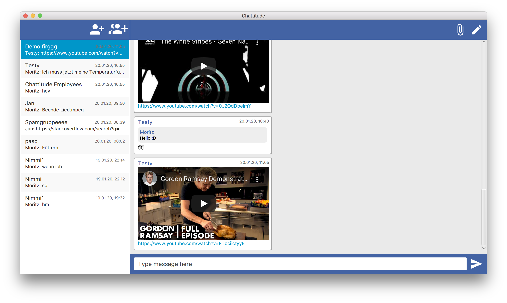
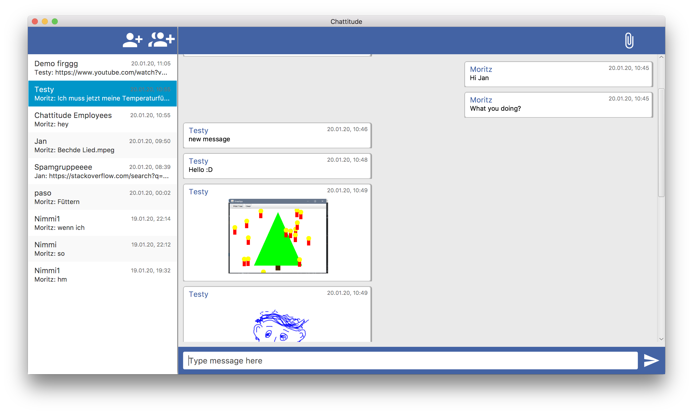
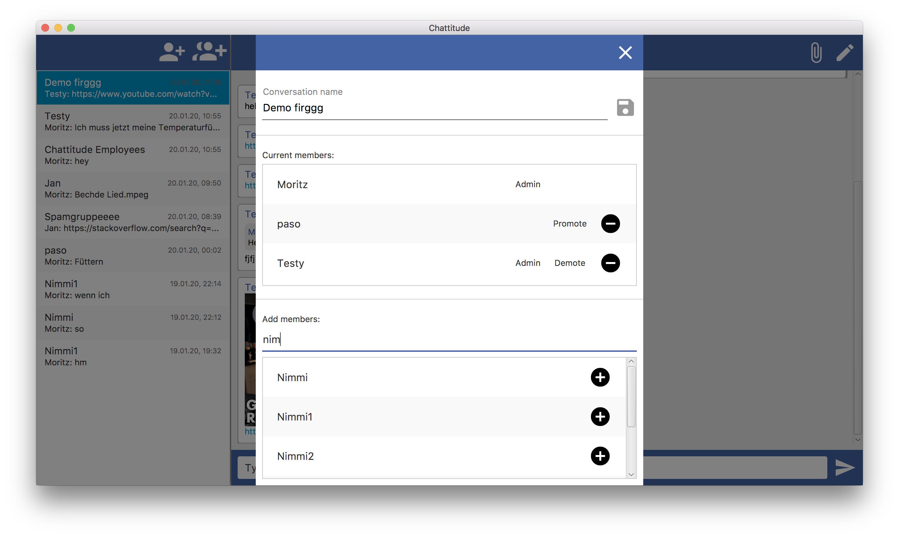
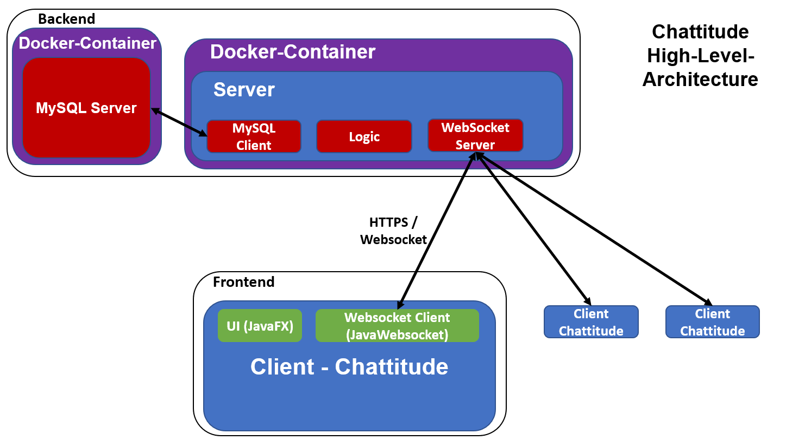

# Chattitude
A messenger for developers and small teams.

Chattitude was developed for the software project module of computer science in the 5th semester at the THU (Technische Hochschule Ulm/Ulm University of Applied Sciences).

## Main Features
* Self-hosted
* Group chats
* File upload
* Youtube embeds
* Message Quoting
* Commands
* Desktop notifications
* Extendable message format

## Architecture

Disclaimer: For simplicty we used SHA-256 for password hashing. This algorithm should **never** be used for password hashing. Always use an appropriate algorithm with salt in a real world application e.g. scrypt, bcrypt or PBKDF2.

© Copyright 2020 Nimmidev, Birkenstab (Moritz Beck), Gloinfur, Paso2
